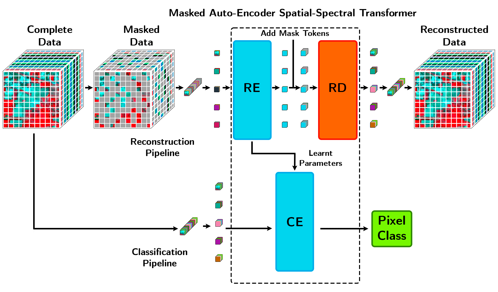

# Masked Auto-Encoding Spectral–Spatial Transformer for Hyperspectral Image Classification

[Damián Ibáñez Fernández](https://orcid.org/0000-0002-3252-1252), [Rubén Fernández Beltrán](https://scholar.google.es/citations?user=pdzJmcQAAAAJ&hl=es), [Filiberto Pla Bañón](https://ieeexplore.ieee.org/author/37270640500), [Naoto Yokoya](https://naotoyokoya.com/)

___________

The code included in this repository implements the ["Masked Auto-Encoding Spectral–Spatial Transformer for Hyperspectral Image Classification"](https://ieeexplore.ieee.org/document/9931741). 

Deep learning has certainly become the dominant trend in hyperspectral (HS) remote sensing (RS) image classification owing to its excellent capabilities to extract highly discriminating spectral–spatial features. In this context, transformer networks have recently shown prominent results in distinguishing even the most subtle spectral differences because of their potential to characterize sequential spectral data. Nonetheless, many complexities affecting HS remote sensing data (e.g., atmospheric effects, thermal noise, quantization noise) may severely undermine such potential since no mode of relieving noisy feature patterns has still been developed within transformer networks. To address the problem, this article presents a novel masked auto-encoding spectral–spatial transformer (MAEST), which gathers two different collaborative branches: 1) a reconstruction path, which dynamically uncovers the most robust encoding features based on a masking auto-encoding strategy, and 2) a classification path, which embeds these features onto a transformer network to classify the data focusing on the features that better reconstruct the input. Unlike other existing models, this novel design pursues to learn refined transformer features considering the aforementioned complexities of the HS remote sensing image domain. The experimental comparison, including several state-of-the-art methods and benchmark datasets, shows the superior results obtained by MAEST.

Citation
---------------------

**Please kindly cite the papers if this code is useful and helpful for your research.**

D. Ibañez, R. Fernandez-Beltran, F. Pla and N. Yokoya, "Masked Auto-Encoding Spectral–Spatial Transformer for Hyperspectral Image Classification," in IEEE Transactions on Geoscience and Remote Sensing, vol. 60, pp. 1-14, 2022, Art no. 5542614, doi: 10.1109/TGRS.2022.3217892.

    @ARTICLE{9931741,
      author={Ibañez, Damian and Fernandez-Beltran, Ruben and Pla, Filiberto and Yokoya, Naoto},
      journal={IEEE Transactions on Geoscience and Remote Sensing}, 
      title={Masked Auto-Encoding Spectral–Spatial Transformer for Hyperspectral Image Classification}, 
      year={2022},
      volume={60},
      number={},
      pages={1-14},
      doi={10.1109/TGRS.2022.3217892}
      }

Danfeng Hong, Zhu Han, Jing Yao, Lianru Gao, Bing Zhang, Antonio Plaza, Jocelyn Chanussot. Spectralformer: Rethinking hyperspectral image classification with transformers, IEEE Transactions on Geoscience and Remote Sensing (TGRS), 2022, vol. 60, pp. 1-15, Art no. 5518615, DOI: 10.1109/TGRS.2021.3130716.

    @article{hong2022spectralformer,
      title={Spectralformer: Rethinking hyperspectral image classification with transformers},
      author={Hong, Danfeng and Han, Zhu and Yao, Jing and Gao, Lianru and Zhang, Bing and Plaza, Antonio and Chanussot, Jocelyn},
      journal={IEEE Trans. Geosci. Remote Sens.},
      year={2022},
      volume={60},
      pages={1-15},
      note = {DOI: 10.1109/TGRS.2021.3130716}
    }
    
    
System-specific notes
---------------------
The data were generated by Matlab R2016a or higher versions, and the codes of networks were tested using PyTorch 1.12 version (CUDA 11.3) in Python 3.6 on Ubuntu system Ubuntu 16.04 x64 machine with Intel(R) Core(TM) i7-6850 K processor with 110-GB RAM with an NVIDIA GeForce GTX 1080 Ti 11 GB.

Reconstruction training
---------------------

The model learns in two steps. In the first one, a masked self-supervised auto-encoder learns to reconstruct the original hyperspectral image, given a masked observation. For this, run the file **demo.py** with the desired hyperparameters and settings. 
Here is an example using the different datasets with the parameters used in the paper. Please note that due to the randomness of the parameter initialization, the experimental results might have slightly different from those reported in the paper.

:exclamation: Please kindly be careful on assigning arguments such as `epoches` and `weight_decay`. Also, remember to change the paths for the arguments `output_dir` and `model_path`.

**Indian Pines Dataset**

Pixel-wise MAEST: `python demo.py --dataset='Indian' --epoch=500 --patches=1 --band_patches=3 --mode='ViT' --weight_decay=0 --flag='train'`

Patch-wise MAEST: `python demo.py --dataset='Indian' --epoches=200 --patches=7 --band_patches=3 --mode='ViT' --weight_decay=0 --flag='train'`

**Pavia Dataset**

Pixel-wise MAEST: `python demo.py --dataset='Pavia' --epoch=500 --patches=1 --band_patches=3 --mode='ViT' --weight_decay=0 --flag='train'`

Patch-wise MAEST: `python demo.py --dataset='Pavia' --epoches=80 --patches=7 --band_patches=7 --mode='ViT' --weight_decay=0 --flag='train'`

**Houston Dataset**

Pixel-wise MAEST: `python demo.py --dataset='Houston' --epoch=200 --patches=1 --band_patches=3 --mode='ViT' --weight_decay=0 --flag='train'`

Patch-wise MAEST: `python demo.py --dataset='Houston' --epoches=80 --patches=7 --band_patches=3 --mode='ViT' --weight_decay=0 --flag='train'`

or directly test by loading the reconstruction trained model parameters in the `log` file we have tuned locally.

For the datasets of **Pavia Dataset** and **Houston Dataset**, you can download the data we use from the following links of google drive or baiduyun:

Google drive: https://drive.google.com/drive/folders/1nRphkwDZ74p-Al_O_X3feR24aRyEaJDY?usp=sharing

Baiduyun: https://pan.baidu.com/s/1ZRmPQYahqvbkMoH_B6v1xw (access code: 29qw)

Finetuning
---------------------
In the second step the model improves the learned features for the hyperspectral image classification task. Now, run the file **demo.py** with the desired hyperparameters and settings for finetuning. Here is an example using the different datasets with the parameters used in the paper. Please note that due to the randomness of the parameter initialization, the experimental results might have slightly different from those reported in the paper.

:exclamation: For finetuning, in addition to the careful assignament of the previous arguments, include the path of the previously trained reconstruction model `trained_model`. 

**Indian Pines Dataset**

Pixel-wise MAEST: `python demo.py --dataset='Indian' --epoch=260 --patches=1 --band_patches=3 --mode='CAF' --weight_decay=5e-3 --flag='finetune'`

Patch-wise MAEST: `python demo.py --dataset='Indian' --epoches=300 --patches=7 --band_patches=3 --mode='CAF' --weight_decay=5e-3 --flag='finetune'`

**Pavia Dataset**

Pixel-wise MAEST: `python demo.py --dataset='Pavia' --epoch=300 --patches=1 --band_patches=3 --mode='CAF' --weight_decay=5e-3 --flag='finetune'`

Patch-wise MAEST: `python demo.py --dataset='Pavia' --epoches=400 --patches=7 --band_patches=7 --mode='CAF' --weight_decay=5e-3 --flag='finetune'`

**Houston Dataset**

Pixel-wise MAEST: `python demo.py --dataset='Houston' --epoch=500 --patches=1 --band_patches=3 --mode='CAF' --weight_decay=5e-3 --flag='finetune'`

Patch-wise MAEST: `python demo.py --dataset='Houston' --epoches=260 --patches=7 --band_patches=3 --mode='CAF' --weight_decay=5e-3 --flag='finetune'`

or directly test by loading the finetune model parameters in the `log` file we have tuned locally.

Testing
---------------------
To obtain the testing results:

**Indian Pines Dataset**

Pixel-wise MAEST: `python demo.py --dataset='Indian' --patches=1 --band_patches=3 --mode='CAF' --flag='test'`

Patch-wise MAEST: `python demo.py --dataset='Indian' --patches=7 --band_patches=3 --mode='CAF' --flag='test'`

**Pavia Dataset**

Pixel-wise MAEST: `python demo.py --dataset='Pavia' --patches=1 --band_patches=3 --mode='CAF' --flag='test'`

Patch-wise MAEST: `python demo.py --dataset='Pavia' --patches=7 --band_patches=7 --mode='CAF' --flag='test'`

**Houston Dataset**

Pixel-wise MAEST: `python demo.py --dataset='Houston' --patches=1 --band_patches=3 --mode='CAF' --flag='test'`

Patch-wise MAEST: `python demo.py --dataset='Houston' --patches=7 --band_patches=3 --mode='CAF' --flag='test'`

If you want to run the code in your own data, you can accordingly change the input (e.g., data, labels) and tune the parameters.

If you encounter the bugs while using this code, please do not hesitate to contact us.

Licensing
---------

Copyright (C) 2022 Damián Ibáñez

This program is free software: you can redistribute it and/or modify it under the terms of the GNU General Public License as published by the Free Software Foundation, version 3 of the License.

This program is distributed in the hope that it will be useful, but WITHOUT ANY WARRANTY; without even the implied warranty of MERCHANTABILITY or FITNESS FOR A PARTICULAR PURPOSE. See the GNU General Public License for more details.

You should have received a copy of the GNU General Public License along with this program.

Contact Information:
--------------------

Damián Ibáñez: ibanezd@uji.es 
Damián Ibáñez is with the Institute of New Imaging Technologies, Universitat Jaume I, 12071 Castellón de la Plana, Spain. 
